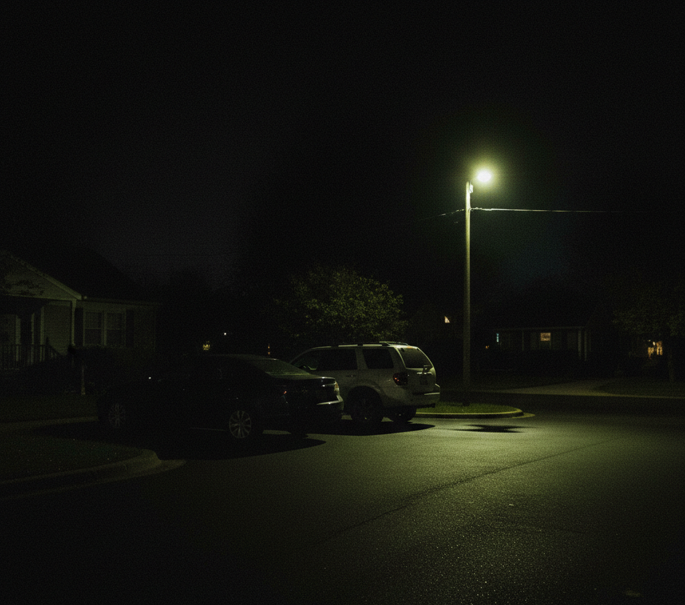
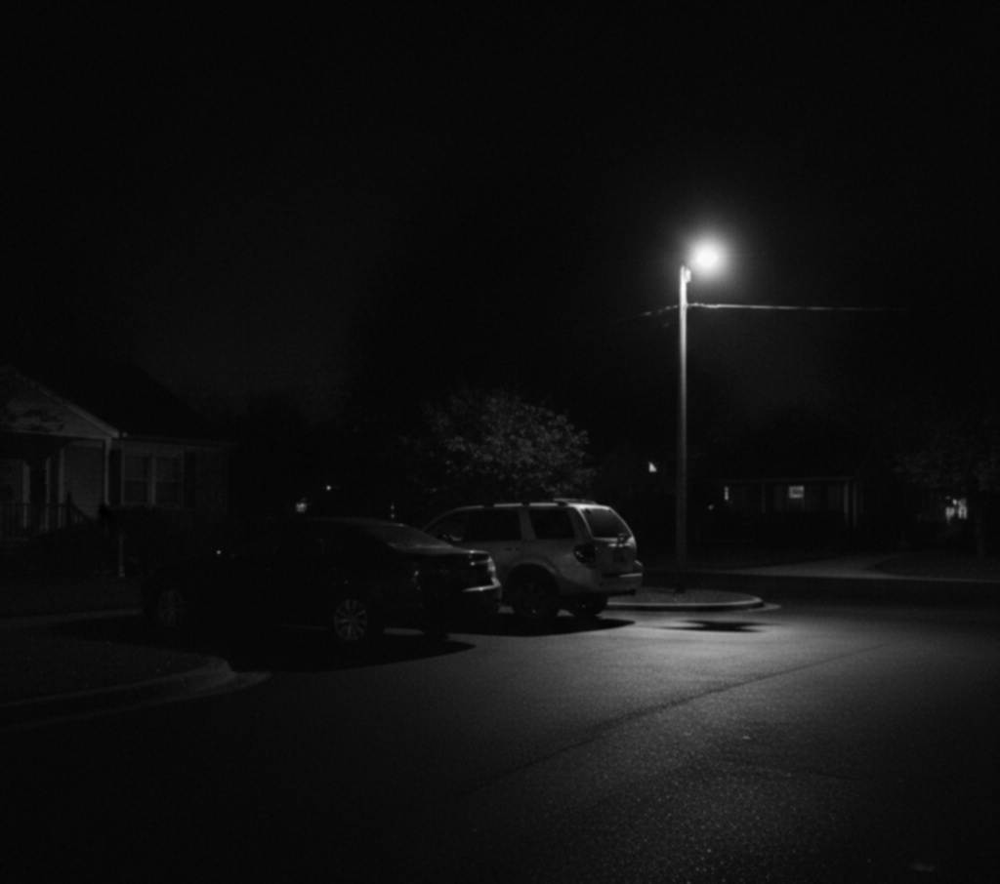

# NightShade – Low-Light Image Processing Algorithm

NightShade is a small, student-level experimental project focused on
understanding how low-light conditions affect vision-based perception
systems.

This project was intentionally kept simple.
Its goal is **learning and reasoning**, not performance or production use.

---

## Project Purpose

Vision systems often struggle in low-light environments.
As illumination decreases, images lose contrast, noise increases,
and false visual features may appear.

NightShade was created to explore these effects using
**basic, explainable image processing techniques** instead of complex or
learning-based models.

The emphasis is on:
- understanding system behavior
- inspecting each processing step
- building intuition about perception reliability

---

## What This Project Is (and Is Not)

**This project is:**
- A learning-oriented algorithm
- A single-image processing pipeline
- Designed to be easy to debug and explain
- Built as part of a weekly personal practice series

**This project is NOT:**
- Production-ready software
- Optimized for maximum accuracy
- Based on deep learning or AI models
- Intended to compete with real-world vision systems

Keeping the scope small was a **deliberate design choice**.

---

## How NightShade Works (High-Level)

1. Load a low-light input image
2. Apply basic contrast enhancement
3. Reduce noise without aggressive filtering
4. Save the enhanced result to the output directory

Each step is simple and transparent,
so the algorithm’s behavior can be clearly observed and understood.

---

## Project Structure
NightShade/
├── src/
│ ├── main.py
│ ├── image_loader.py
│ └── image_processor.py
│
├── sample_images/
│ └── low_light_1.png
│
├── output/
│ └── enhanced_low_light_1.png
│
└── README.md

---

## Sample Result

### Input

### Output

Currently, NightShade processes **one image at a time**.
This was intentional to keep the pipeline easy to inspect and debug
during early development.

---

## Why Keep It This Simple?

At an early learning stage, **explainability matters more than accuracy**.

Complex models may produce better results,
but they often hide important behavior behind abstraction.
This project focuses on understanding *why* vision degrades
and *how* simple processing steps respond to that degradation.

---

## Status

This project is considered **complete for its intended scope**.

Possible future extensions (not implemented here) include:
- Batch image processing
- Parameter sensitivity analysis
- Integration with multi-sensor systems

---

## Final Note

NightShade is not meant to impress with complexity.
It exists to document a learning step
in building perception-aware autonomous systems.

Small, real systems.
Clear behavior.
Steady progress over time.

